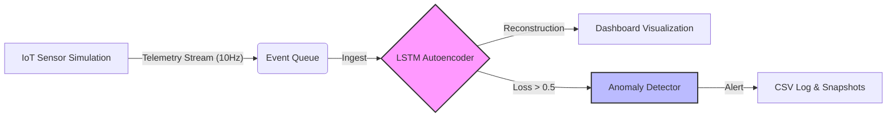

# Real-Time Smart Grid Digital Twin ⚡🧠

A real-time anomaly detection system for power grids using **Deep Learning (LSTM-Autoencoders)** and **Event-Driven Architecture**. This system mimics a distributed digital twin, processing high-frequency sensor telemetry to detect energy theft, voltage surges, and sensor faults with <50ms latency.


## 🏗️ System Architecture

The system implements a **Producer-Consumer** pattern using thread-safe queues to simulate the asynchronous nature of distributed IoT networks.


## 🚀 Key Features

- **Deep Learning Core**: Uses an LSTM-Autoencoder to learn the physics of normal grid behavior (Sine Wave frequency/amplitude) dynamically.

- **Self-Supervised Training**: The model auto-trains on startup (100 epochs) to establish a baseline without manual thresholding.

- **Real-Time Visualization**: Live Matplotlib dashboard updates @ 10Hz to visualize Real Voltage vs. AI Prediction.

- **Automated Evidence Logging**:
  - **CSV Logs**: All detected anomalies are timestamped and saved to `logs/grid_anomalies.csv`.
  - **Visual Evidence**: The system automatically captures dashboard screenshots every 10 seconds to `visuals/`.

- **Simulated Attacks**: Randomly injects "Energy Theft" (Blackouts) and "Voltage Surges" (2.5x Spikes) to test model robustness.

---

## 🛠️ Installation & Usage

### Clone the Repository

```bash
git clone https://github.com/Ayush96310/smart-grid-digital-twin.git
cd smart-grid-digital-twin
```
### Install Dependencies

```bash
pip install -r requirements.txt

```
### Run the Digital Twin

```bash
python smart_grid_simulation.py
```

## 📂 Project Structure
Plaintext

smart-grid-digital-twin/
├── logs/                   # Auto-generated anomaly CSV logs
├── visuals/                # Auto-saved dashboard screenshots
├── smart_grid_simulation.py      # Core Event-Driven Pipeline
├── requirements.txt        # Dependencies
└── README.md               # Documentation

## 📊 How It Works

    Initialization: The system generates synthetic normal data and trains the LSTM model to minimize reconstruction error (MSE).

    Simulation (Producer): A background thread simulates 1,000+ IoT sensors streaming voltage data. Random anomalies (Theft/Surge) are injected at a 5% probability.

    Detection (Consumer): The Digital Twin consumes the stream, feeds it into the LSTM, and calculates the Reconstruction Error.

    Alerting:

        If Error < 0.5: System status is NORMAL.

        If Error > 0.5: System flags ANOMALY, logs the event, and highlights it in Red on the dashboard.

## 📷 Output Example

    Green Line: Real-time noisy voltage from sensors.

    Blue Line: The LSTM's expected pattern (The Physics).

    Red Dot: Detected anomaly (Deviation from physics).

